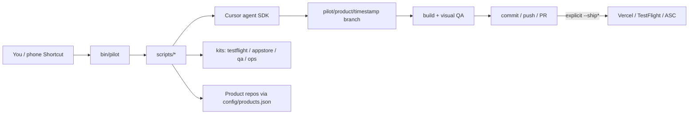

# LaunchPilot

**Local shipping orchestration for multi-product indie studios.**

LaunchPilot is a fail-closed CLI that drives the same change loop across every app and marketing site on your Mac:

```text
prompt → Cursor agent on a fresh branch → build → visual QA → commit → push → PR → STOP
```

Production deploys, TestFlight uploads, and App Store Connect submit are **never** implied. They only run when you pass an explicit `--ship*` flag (or the matching standalone command). `--ship` never means App Store submit.

Built so other builders can reuse the pattern — and so hiring managers can see how [TJ Kade](https://github.com/Jefferson258) ships **Corvim**, **Juicd**, and **Velour Closet** with one gated pipeline instead of a pile of one-off scripts.

> **Status:** production-used locally for App Store / TestFlight / Vercel shipping. Bundled `demo-site` works with zero API keys.

---

## Why it exists

Shipping one indie app is fine. Shipping **several** (iOS + watchOS + marketing sites + ads + IAP) turns into:

- inconsistent branching / QA / PR habits
- agents that happily edit a dirty tree
- accidental production deploys
- screenshots and TestFlight steps that only live in someone’s head

LaunchPilot makes the happy path boring:

1. **Product registry** — one JSON map of apps/sites and how to build/QA them
2. **Agent gate** — refuse to start coding if the product repo is dirty
3. **Evidence jobs** — each run lands under `jobs/` (gitignored) with prompts, logs, screenshots
4. **Hard ship gates** — preview/prod/TestFlight/App Store are explicit and separate

It does **not** replace Xcode, App Store Connect, or Vercel. It **orchestrates** them.

---

## Architecture



| Layer | Role |
|---|---|
| `bin/pilot` | Stable CLI surface |
| `scripts/` | Pipeline steps (`code`, `build`, `qa`, `release`, …) |
| `kits/` | Reusable TestFlight, App Store, visual QA, analytics, ops helpers |
| `config/` | Product/policy templates (secrets gitignored) |
| `examples/demo-site` | Bundled demo — no credentials |
| `intake/` | Inbox + single-flight `dispatch` |
| `jobs/` | Per-run evidence (**gitignored**) |

---

## 5-minute demo (no API keys)

Requires **Node 20+**. First visual QA may download Playwright Chromium.

```bash
git clone https://github.com/Jefferson258/LaunchPilot.git
cd LaunchPilot
./bin/pilot demo
```

That will:

1. Resolve the bundled **demo-site** product
2. Build it
3. Capture visual-QA screenshots into a new `jobs/demo-site-…` folder

No Cursor key, Vercel token, or Apple cert required.

```bash
./bin/pilot preflight    # tools / auth / config report
./bin/pilot products     # registry keys
./bin/pilot build demo-site
./bin/pilot qa demo-site
```

---

## Install for your own products

```bash
cd LaunchPilot
cp config/pilot.env.example config/pilot.env
cp config/products.example.json config/products.json
# edit products.json — keep demo-site, add your apps/sites

# iOS uploads (optional):
cp kits/testflight/config.example.sh kits/testflight/config.sh
cp kits/testflight/apps.example.sh kits/testflight/apps.sh
# edit those; keep ASC .p8 under ~/.appstoreconnect/ — see docs/SETUP.md

(cd agent && npm install)   # only needed for `pilot code` / `pilot run`
./bin/pilot preflight
```

### Workspace layout

Product repos live under a **workspace root**. Default: parent of `LaunchPilot/`. Override with `PILOT_WORKSPACE` (shell or `pilot.env`):

```text
workspace/                 ← PILOT_WORKSPACE
  LaunchPilot/             ← this repo
    examples/demo-site/
    kits/testflight/       ← secrets gitignored
  Corvim/
  Juicd/
  VelourCloset/
  *-website/
```

**Secrets map:** [docs/SETUP.md](docs/SETUP.md) · [SECURITY.md](SECURITY.md).

---

## Commands

| Command | What it does | Needs |
|---|---|---|
| `pilot demo` | Build + QA bundled demo site | Node |
| `pilot preflight` | Tools, auth, config, repos | — |
| `pilot products` | List `config/products.json` keys | products.json |
| `pilot build <product>` | App compile-check or web build | Xcode / Node |
| `pilot qa <product>` | Visual QA screenshots → job dir | sim / Playwright |
| `pilot code <product> "<prompt>"` | Cursor agent on fresh `pilot/…` branch | `CURSOR_API_KEY` |
| `pilot release <product> "<msg>" [--pr]` | Commit + push; optional PR | `gh` auth |
| `pilot deploy <product> [--prod]` | Vercel deploy (preview default) | `VERCEL_TOKEN` |
| `pilot testflight <product> --confirm` | Archive + upload (gated) | testflight kit |
| `pilot appstore-submit <product> [--dry-run\|--confirm]` | ASC Submit for Review | ASC API key |
| `pilot run <product> "<prompt>"` | code → build → qa → release; stops at PR | above |
| `… --ship-preview` | After PR: web preview | Vercel |
| `… --ship-prod` / `--ship` (web) | After PR: production web | Vercel |
| `… --ship-testflight` / `--ship` (app) | After PR: TestFlight | testflight kit |
| `… --ship-appstore` | After PR: ASC Submit (**not** implied by `--ship`) | ASC API |
| `pilot remote-run …` | Phone/SSH: caffeinate + run + sleep/shutdown | same as `run` |
| `pilot remote-check` | Sleep-wake / cold-boot readiness | macOS |
| `pilot dispatch […]` | Intake dispatch + explicit recovery | — |
| `pilot watch-spikes` / `watch-status` | Error-spike watcher (no auto-ship) | launchd optional |
| `pilot http-smoke <url> [routes…]` | Read-only HTTP smoke | curl |

Default `pilot run` **does not** ship to real users. App Store Submit is **opt-in only**.

### Examples

```bash
# Stop at PR (safe default)
./bin/pilot run demo-site "Shorten the hero headline"

# Production site (explicit)
./bin/pilot run my-site "Update pricing copy" --ship-prod

# TestFlight (explicit)
./bin/pilot run my-app "Fix empty-state copy" --ship-testflight

# Type-aware shorthand (--ship never submits to App Review)
./bin/pilot run my-site "…" --ship      # → prod deploy
./bin/pilot run my-app "…" --ship       # → TestFlight

# App Store submit — dry-run first
./bin/pilot appstore-submit my-app --dry-run

# From iPhone Shortcuts over SSH
./bin/pilot remote-check
./bin/pilot remote-run demo-site "Phone smoke" --sleep
```

Phone paths: [docs/PHONE.md](docs/PHONE.md) · [docs/shortcuts-iphone.md](docs/shortcuts-iphone.md).

---

## Product config

`config/products.json` is **gitignored**. Copy the example:

```bash
cp config/products.example.json config/products.json
```

Field names vary slightly by template version — treat `config/products.example.json` as source of truth. Typical ideas:

| Field | Used for |
|---|---|
| `type` | `web` or `app` |
| `repo` | Sibling folder name, or `examples/…` inside LaunchPilot |
| `web_build` / build command | Web/app build |
| `qa_cmd` / `qa_out` | Visual QA command + screenshot folder |
| TestFlight key | Maps into `kits/testflight` |
| Vercel project | Preview/prod deploys |
| `auto_ship` | Documentary only — CLI `--ship*` still required |

---

## Safety model

- **Dirty tree = no agent.** `scripts/code.sh` exits if the product repo has uncommitted changes. Because `demo-site` lives inside this repo, keep LaunchPilot’s own working tree clean before `pilot code demo-site` / dispatch.
- **Default stops at PR.** Prod / TestFlight / App Store need explicit flags.
- **`--ship` ≠ App Store.** Submit is only `--ship-appstore` or `appstore-submit --confirm`.
- **Secrets stay local.** Env files, product registry, `jobs/`, `.p8` keys, and kit secret files are gitignored — see [SECURITY.md](SECURITY.md).
- **Spike watcher does not auto-ship.** Alerts only.

### Going public checklist

Before flipping the GitHub repo to **Public**:

1. Confirm secret env / products files were never committed (`git log --all -- config/pilot.env`).
2. Confirm no `.p8`, tokens, or account numbers in history.
3. Keep real product IDs in gitignored local config; examples only in git.
4. Run `./bin/pilot demo` on a clean clone.
5. In GitHub → Settings → Danger Zone → **Change visibility → Public** (manual).

---

## Portfolio context

LaunchPilot is the shipping spine behind:

| Product | Stack (high level) | Role of LaunchPilot |
|---|---|---|
| **Corvim** | SwiftUI, watchOS, Supabase, StoreKit | Build/QA/PR + gated TestFlight |
| **Juicd** | SwiftUI, Supabase, AdMob | Same loop; ads-safe shipping habits |
| **Velour Closet** | SwiftUI / iPad-first | Same kits, separate product entry |
| Marketing sites | Next/Vercel | Production only with `--ship-prod` |

If you are evaluating the author: this repo is the “I don’t just write features — I build the system that ships them safely” artifact.

---

## Docs map

| Doc | Topic |
|---|---|
| [docs/SETUP.md](docs/SETUP.md) | Secrets, first run, Apple/Vercel |
| [docs/VISUAL_QA.md](docs/VISUAL_QA.md) | Screenshot QA contracts |
| [docs/PHONE.md](docs/PHONE.md) | SSH / Shortcuts remote runs |
| [docs/ROLLOUT.md](docs/ROLLOUT.md) | Staged App Store / Vercel notes |
| [docs/WEBSITE_CI.md](docs/WEBSITE_CI.md) | GitHub Actions for the demo site |
| [docs/COMPARISON.md](docs/COMPARISON.md) | vs CI-only / other kits |
| [SECURITY.md](SECURITY.md) | What must never be committed |
| [CONTRIBUTING.md](CONTRIBUTING.md) | PR expectations |
| [AGENTS.md](AGENTS.md) | Rules for unattended agent runs |

---

## License

MIT — [LICENSE](LICENSE).

---

## Honest roadmap

- Keep policy gates enforced in every ship path (prefer fail-closed scripts over docs-only warnings)
- Optional TestFlight without a fixed sibling-path assumption
- Notion sync remains off-by-default
- More polished `pilot demo` output for first-time clone visitors
